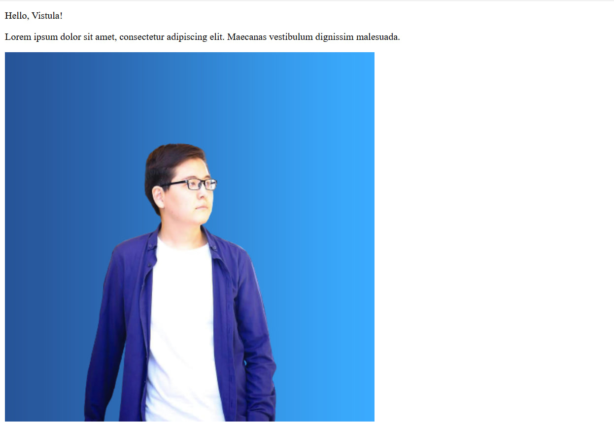

MyFirstSpringApp - TASK 1

DESCRIPTION:

This is a simple Spring Boot project on JAVA demonstrating the basics of handling HTTP requests. It contains controller that repsonds to a specific HTTP request and returns a simple text response. The application will start on a local server at `http://localhost:8080`.

SCREENSHOT:

I have a screenshot that displays my greeting page with my picture

Student: Ersultan Ismailov 70662